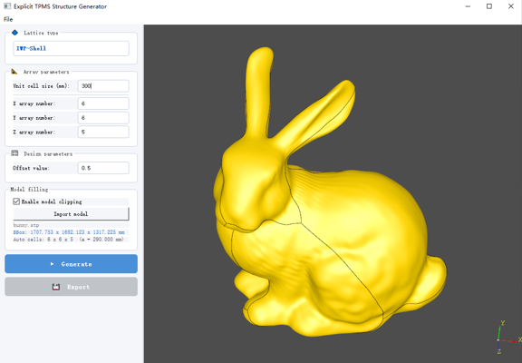
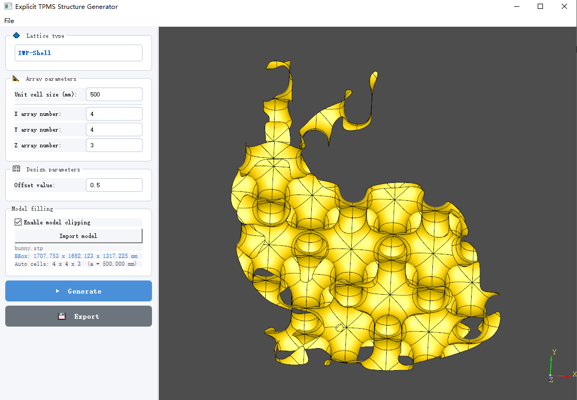
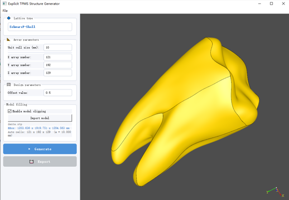
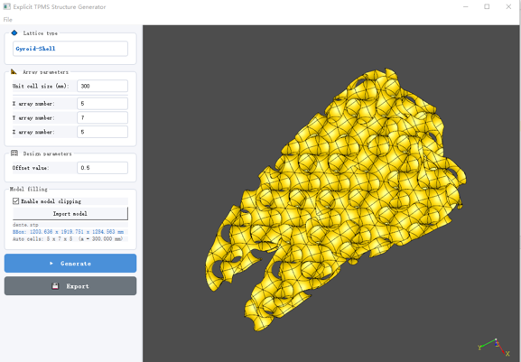
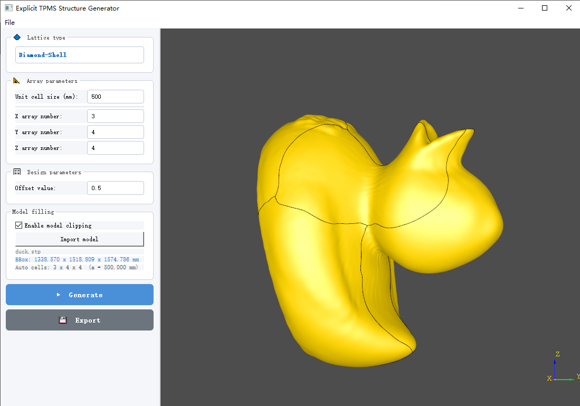
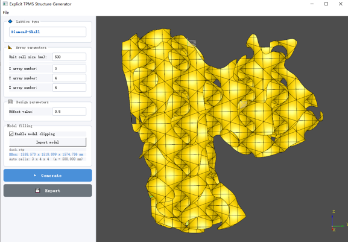
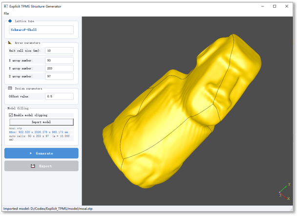
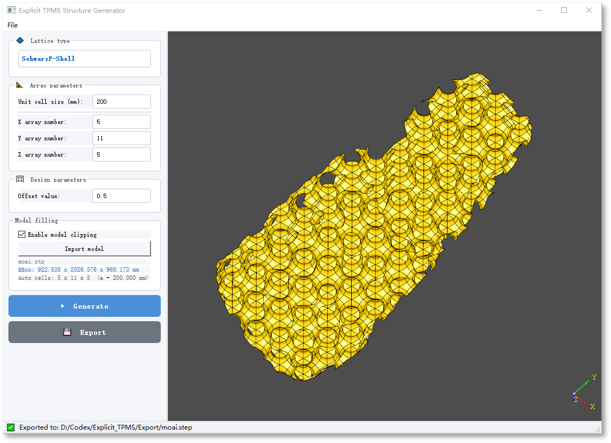

# Explicit TPMS Structure Generator

A Windows desktop application for creating explicit TPMS lattice structures with a graphical user interface. 

The application uses PyQt5 for user interface and [CadQuery](https://github.com/CadQuery/cadquery) for parametric CAD modeling. CadQuery is built on the [Open CASCADE Technology](https://dev.opencascade.org/) geometry kernel. The graphical interface is implemented specifically for this project.

For information about CadQuery, refer to its [GitHub repository](https://github.com/CadQuery/cadquery) and [official documentation](https://cadquery.readthedocs.io/en/latest/).

## 1. Installation

The current release supports 64-bit Windows 10 and Windows 11.

### 1.1 Requirements

All installations require a graphics driver with OpenGL support. Installing from source additionally requires:

- Python 3.12
- Git

The package versions listed in `requirements.txt` correspond to the tested software environment. Users are recommended to install the specified versions to ensure compatibility and reproducibility.

The prebuild exe installer does not require manual dependency installation.

### 1.2 Install from source

Open **Command Prompt** in Windows and run:

```cmd
git clone https://github.com/lijiayi2126/Explicit-TPMS-Structure-Generator.git
cd Explicit-TPMS-Structure-Generator
python -m venv venv
venv\Scripts\activate
python -m pip install --upgrade pip
pip install -e .
python UI.py
```

`python -m venv venv` creates an isolated Python environment in the project folder. After activation, `pip install -e .` installs the application and the dependencies declared in `pyproject.toml`.

When using PowerShell, activate the environment with:

```powershell
.\venv\Scripts\Activate.ps1
```

If PowerShell blocks script execution, use Command Prompt or allow locally created scripts for the current user:

```powershell
Set-ExecutionPolicy -Scope CurrentUser RemoteSigned
```

### 1.3 Install from EXE

Users who do not need the source code can download the prebuilt Windows executable directly:

[Download Explicit-TPMS-Structure-Generator.exe](https://github.com/lijiayi2126/Explicit-TPMS-Structure-Generator/releases/download/v0.1.0/Explicit-TPMS-Structure-Generator.exe)

Double-click the executable to start the application.

### 1.4 Start a source installation later

After opening a new Command Prompt, return to the project folder and reactivate the virtual environment:

```cmd
cd Explicit-TPMS-Structure-Generator
venv\Scripts\activate
python UI.py
```


## 2. Usage

The definitions of the four lattice structure types (Schwarz P, I-WP, Gyroid, and Diamond) are provided in the `Lattice_lib` folder. After activating the installed virtual environment, run the main Python script as follows:

```bash
python UI.py
```

### 2.1 Lattice type

Click `Lattice Type`, the user can choose from the following topologies include:

* Shell
  * Schwarz P
  * Schoen I-WP
  * Gyroid
  * Diamond
* Solid
  * Schwarz P
  * Schoen I-WP
  * Gyroid
  * Diamond

### 2.2 Array parameters

The user can enter the unit cell size in `Unit cell size`, the unit is mm. The user can also enter how many unit cells to generate in the X, Y and Z directions respectively.

### 2.3 Design parameters

For different types of TPMS cells, the program provides predefined one-to-one mappings between thickness $t$ and relative density $\rho$. Users can specify either the thickness parameter or the relative density, and the program will generate the corresponding lattice structure accordingly.

### 2.4 Model Filling

This software supports the generation of lattice-filled geometric models based on Boolean operations. By clicking `Import Model`, users can import a geometric model from a specified location. The supported import and export formats include STEP, STL and IGES.

Based on the dimensions of the imported geometric model, the software automatically calculates the number of unit cells required in the X, Y, and Z directions. Users can adjust the unit cell size to control the filling resolution and generate lattice structures with different levels of geometric detail.

Several example models are provided in the `BooleanExamples` folder. The corresponding geometric models and porous structures are shown below:

| Model | Lattice-filled structure |
| --- | --- |
|  |  |
|  |  |
|  |  |
|  |  |
